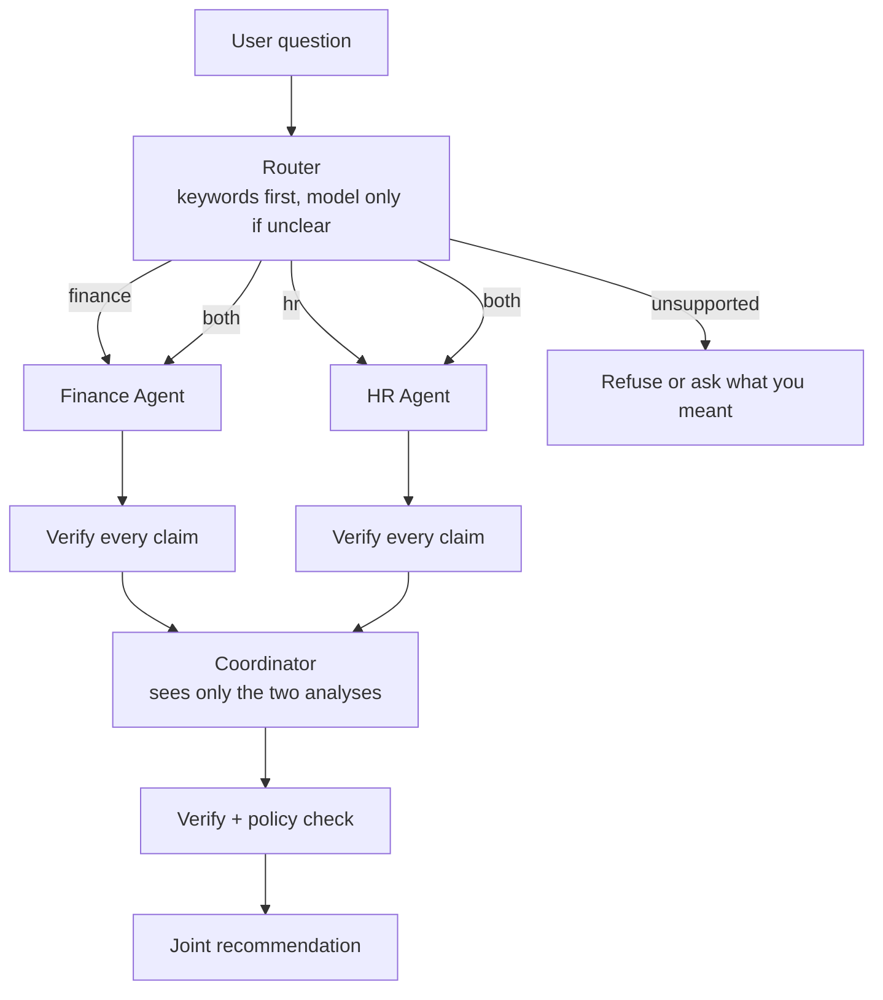

# Cherry Host - Finance & HR AI Agents

A small proof of concept for the Cherry Host / REJ Investment AI Engineer assessment.

Ask a business question. The system decides which department should answer, asks that department's
agent, **checks every number in the answer against the source data**, and refuses the answer if
anything doesn't check out. For questions that need both departments, it asks both and reconciles
them into one recommendation.

The project supports two execution modes:

- **Live Anthropic mode** connects to the real Anthropic API. The routing fallback uses the
  configured Anthropic routing model, Haiku 4.5, and Finance, HR and coordinator analysis use the
  configured Anthropic analysis model, Sonnet 5.
- **Offline evaluation mode** replays recorded Anthropic responses so the project can be evaluated
  without an API key. It is deterministic and works best with the included examples; unusual wording
  may not match as well as live mode.

Both modes use the same application logic for routing, agent isolation, verification and
orchestration. Offline responses do not replace the safeguards; they only replace live model calls.

It is deliberately small and deliberately not production-ready. What it tries to demonstrate is the
part that actually matters: **agent isolation and grounding are enforced by code and proven by
tests, not requested in a prompt.**

---

## Contents

- [Run the project](#run-the-project)
- [Example questions](#example-questions)
- [What the output looks like](#what-the-output-looks-like)
- [Explain mode](#explain-mode)
- [Architecture](#architecture)
- [Agent isolation](#agent-isolation)
- [Claim verification](#claim-verification)
- [Joint recommendation flow](#joint-recommendation-flow)
- [Mock data](#mock-data)
- [Testing](#testing)
- [Key decisions and trade-offs](#key-decisions-and-trade-offs)
- [Live API findings](#live-api-findings)
- [Configuration](#configuration)
- [Project structure](#project-structure)
- [Production evolution](#production-evolution)
- [Limitations](#limitations)
- [AI-assisted development](#ai-assisted-development)
- [Documents](#documents)

---

## Run the project

### Live Anthropic mode

This mode connects to the real Anthropic API. The routing fallback uses Haiku 4.5, and Finance, HR
and coordinator analysis use Sonnet 5.

```bash
npm install
cp .env.example .env
```

Then edit `.env`: set `ANTHROPIC_API_KEY=sk-ant-...` and change `LLM_PROVIDER` to `anthropic`.
Now use `npm run dev`:

```bash
npm run dev -- "Should we hire more people?"
```

`.env` is git-ignored - never commit it.

### Offline evaluation mode

You do not need an API key to run or evaluate this. `dev:mock` replays real Anthropic responses that
were recorded and committed, so the whole system works offline.

```bash
npm install
npm run dev:mock -- "Should we hire more people?"
```

Offline mode still uses the same real application logic for routing, agent isolation, verification
and orchestration. The only difference is that model calls are answered from recorded Anthropic
responses.

Offline mode picks the closest recorded answer by keyword, so the included example questions always
fit well. Ask something unusual offline and you'll get the nearest recorded answer, which may not
match. Live mode handles any question in any wording.

**Windows note:** every script is cross-platform. Use `npm run dev:mock -- "your question"` in
PowerShell, cmd, or bash - the `LLM_PROVIDER=mock` prefix style you may see elsewhere does not work
in PowerShell, which is exactly why there's a dedicated script.

---

## Example questions

The examples can be run in either mode. Use `npm run dev` for live Anthropic mode, or replace it with
`npm run dev:mock` for offline evaluation.

**Finance questions** -> answered by the Finance Agent alone

```bash
npm run dev -- "What is our operating margin?"
npm run dev -- "What is our monthly revenue?"
npm run dev -- "How much runway do we have left?"
```

**HR questions** -> answered by the HR Agent alone

```bash
npm run dev -- "Which team is over capacity?"
npm run dev -- "How many employees do we have?"
npm run dev -- "What is our voluntary turnover?"
```

**Questions needing both** -> both agents run, then a coordinator reconciles them

```bash
npm run dev -- "Should we hire more people?"
npm run dev -- "Can we afford another operations employee?"
npm run dev -- "Is the company ready to expand the team?"
npm run dev -- "Which department should receive the next hire?"
```

**Questions it refuses** -> no data, or too vague to guess

```bash
npm run dev -- "What is the weather in Madrid?"
npm run dev -- "How are we doing?"
```

**Interactive mode** - run with no question, then type. `:exit` to quit.

```bash
npm run dev
```

---

## What the output looks like

```
Route: finance  (rules, confidence 0.92)
Reason: The question asks about margin, which is finance data.

Finance Agent
For 2026-Q2, Cherry Host's operating margin is 13.59%, derived from monthly revenue of
412000 and monthly operating costs of 356000, yielding a monthly operating profit of 56000.

Facts used
  - Operating margin          13.59    [operatingMarginPercent]
  - Monthly revenue           412,000  [monthlyRevenue]
  - Monthly operating costs   356,000  [monthlyOperatingCosts]
  - Monthly operating profit  56,000   [monthlyOperatingProfit]

✓ 4 claim(s) verified against source fields.
```

Every number is tagged with the exact field it came from, and the tick line means each one was
checked against the dataset - not just stated.

### When a claim doesn't check out

This is the important behaviour. Below is a **real run** where a value was deliberately corrupted:

```
Route: finance  (rules, confidence 0.92)
Reason: The question asks about margin, which is finance data.

✗ The Finance Agent's response failed verification and was not accepted.

Problems found:
  - "monthlyRevenue" was reported as 450000 but the authorised value is 412000.

No answer is shown, because an unverified business figure is worse than no figure.
```

The system gets one repair attempt first. If the answer still doesn't verify, **you get the refusal
rather than the answer**. Exit code `2`.

---

## Explain mode

Add `--explain` to see how the decision was made:

```bash
npm run dev:mock -- "Should we hire more people?" --explain
```

You get: the routing decision and what triggered it, the exact fields each agent used, verification
counts, the constraints that were computed in code, whether the final verdict is consistent with
them, and token usage against the budget.

```
Constraints computed in code
  maxAffordableHires: 1
  departmentsOverCapacity: operations, maintenance
  fundedOpenRoles: Maintenance Coordinator

Policy check
  Verdict: hire_conditionally
  Consistent with computed constraints: yes
  Supporting facts traced upstream: 8
  Trusted: yes

Model usage
  Provider model: anthropic
  Calls: 3
  Tokens in/out: 8487/6306
  Budget: 14,793 of 200,000 tokens used
```

**Every line comes from data the application already holds.** No hidden model reasoning is
requested, stored, or shown. "Explainability" that leaks a model's private chain-of-thought is a
liability, not a feature.

---

## Architecture



**Inside an agent:** build a fact sheet from its own data (raw fields plus metrics computed in
TypeScript) -> build a prompt from that fact sheet only -> ask the model -> verify every claim -> one
repair attempt if needed -> return the answer marked trusted or not.

---

### Agent isolation

> **System prompts guide model behaviour, but they are not treated as a security boundary.**

The prompts do say "use only the supplied facts," because it improves behaviour. But none of the
isolation depends on the model cooperating:

1. **One wiring file.** Only `src/composition.ts` is allowed to import both datasets. A test scans
   the source to enforce it.
2. **Separate types.** `FinanceData` and `HrData` share no fields, so handing HR data to the Finance
   agent is a **compile error**, not a runtime leak.
3. **Closures.** Each agent captures its data privately. The returned object has exactly `id` and
   `answer` - there is no `.data` to reach for.
4. **Output checking.** If an agent cites a field belonging to the other department, the answer is
   rejected as `CROSS_DEPARTMENT_FIELD_REFERENCE`.

Mechanism 4 is tested with a **hostile model** - a fake client that deliberately returns a Finance
answer citing HR's `totalEmployees`. It gets refused.

---

### Claim verification

1. Metrics like margin, runway and affordable hires are **calculated in TypeScript**, never by the
   model. The model receives finished numbers.
2. The fact sheet is the model's entire universe. If a value isn't in it, there is no legitimate way
   to state it.
3. Every cited field must exist in **that agent's own** data, and the value must match.
4. Matching is exact-or-correctly-rounded. `13.6` passes for `13.59`; `52,001` does not pass for
   `52,000`.
5. The prose is scanned too - a response whose `facts` are perfect but whose summary invents
   "roughly EUR60,000 of headroom" is caught.
6. One repair attempt, then a visible refusal.

---

## Joint recommendation flow

For "Should we hire more people?", both agents run **at the same time**, independently. Neither sees
the other's data or output. A coordinator then receives **only their two finished analyses** - never
raw data - and produces one recommendation.

The mock data is built so neither agent can answer alone:

- **HR** sees two departments over capacity and two open roles.
- **Finance** can fund **exactly one** hire (EUR52,000 available / EUR48,000 per hire).
- Only one of the two open roles already has budget approved.

The correct answer - fill the funded maintenance role, hold the operations one - needs both sides.

**There is deliberately no agent-to-agent chat.** A free-form debate between two models is the most
impressive-looking version of this and the least trustworthy: every turn is another chance to
hallucinate, errors compound as agents cite each other, and nothing produced is auditable. Instead:
fixed sequence, one coordinator call, everything traceable.

The coordinator also can't overrule arithmetic. `maxAffordableHires` is computed in code; if the
model returns "hire" when that number is `0`, the answer is rejected as `POLICY_CONFLICT`.

---

## Mock data

Mock data only, in two JSON files. Shared period `2026-Q2`, EUR, monthly figures.

**Finance** - revenue EUR412,000 - operating costs EUR356,000 - cash EUR2,848,000 - hiring budget
EUR96,000 approved less EUR44,000 committed - benchmark EUR48,000 per hire.
*Computed in code:* profit EUR56,000 - margin 13.59% - runway 8.0 months - **available budget
EUR52,000** - **affordable hires: 1**.

**HR** - 34 employees across 6 departments - operations (12) and maintenance (6) over capacity -
310 overtime hours last month - 2 open roles (Maintenance Coordinator approved, 63 days open;
Operations Associate awaiting budget, 21 days) - turnover 11.8% - average time to hire 38 days.

**Assumptions, stated plainly.** The EUR48,000 cost per hire is a market benchmark, not an agreed
offer - the agents flag this themselves. Runway is deliberately a zero-revenue stress case, and that
definition is stored *inside* the dataset so it travels with the number.

**Deliberate gaps.** Finance holds no salary data; HR holds no money data. That's not an oversight -
it's what forces each agent to say "I can't answer that" instead of guessing. `data-consistency.test.ts`
checks every total adds up.

---

## Testing

```bash
npm test          # 100 tests
npm run typecheck # strict TypeScript, zero errors
npm run build     # compiles to dist/
```

**No test touches the network.** `tests/setup.ts` installs a guard that makes any outbound request
throw, so a test can never quietly hit the real API.

| Test file | What it proves |
|---|---|
| `isolation.test.ts` | Finance genuinely cannot see HR data, and vice versa |
| `verification.test.ts` | Bad numbers are caught; good ones aren't falsely rejected |
| `joint-recommendation.test.ts` | The two-department flow and its guardrails |
| `data-consistency.test.ts` | The mock data doesn't contradict itself |
| `router.test.ts` | Questions reach the right department |
| `llm-budget.test.ts` | The token cap actually stops spending |

### See the isolation test fail on purpose

A test that can't fail proves nothing. Add this one line to `src/finance/finance.facts.ts`:

```ts
import type { HrData } from "../hr/hr.types";
```

Run `npm test`. It fails immediately:

```
× no finance module imports anything from hr
```

Delete the line and it passes again. I ran this exact check while building.

---

## Key decisions and trade-offs

**Only one file can access both datasets**

Adding a new department requires updating one central file. I accepted this because it keeps the data-access rules easy to find and review.

**Keyword routing first**

The router uses keywords for clear questions and calls the model only when the question is unclear. Keywords may miss unusual wording or other languages, but they are fast, free, and easy to test.

**The router does not receive department data**

This gives the router less context, but it prevents data from being loaded before the system decides which department is allowed to handle the question.

**Claims are verified in code**

The system does not rely only on the prompt to prevent incorrect numbers. A valid answer may occasionally be rejected because of formatting, so the system makes one repair attempt. I prefer refusing an answer over showing an incorrect business figure.

**Metrics are calculated in TypeScript**

Calculations such as profit margin and affordable hires are performed in code rather than by the model. This is less flexible, but it avoids simple numerical mistakes.

**The coordinator receives summaries, not raw data**

The coordinator can only use the verified analyses returned by the agents. It cannot inspect the original department data, which preserves the separation between departments.

**Both agents run in parallel**

For joint questions, the Finance and HR agents run independently at the same time. This makes the response faster, but simultaneous API requests must be controlled to avoid rate-limit issues.

**Offline mode is supported**

Recorded model responses allow the project to run without an API key. They may not behave exactly like the live model for unusual questions, but they still pass through the same verification process.

**Structured output instead of free text**

Structured responses give the model less freedom, but they are much easier to validate and use safely in the application.

---

## Live API findings

Testing with the live Anthropic API revealed a few issues that offline tests did not catch:

1. The selected model did not support the temperature setting, so I removed it.
2. The model sometimes returned values with units, such as "412000 EUR". I updated the verifier to accept valid units while still rejecting incorrect values.
3. A low output-token limit caused JSON responses to be cut off. I increased the limit and added clearer handling for truncated responses.

---

## Configuration

Everything is optional except the API key in live mode. See [.env.example](.env.example).

| Setting | Default | What it does |
|---|---|---|
| `LLM_PROVIDER` | `mock` | `mock` (offline, no key) or `anthropic` (live) |
| `ANTHROPIC_API_KEY` | - | Required only when live |
| `ANTHROPIC_ROUTING_MODEL` | Haiku 4.5 | Cheap model for classification |
| `ANTHROPIC_ANALYSIS_MODEL` | Sonnet 5 | Stronger model for real reasoning |
| `LLM_TOKEN_BUDGET` | `200000` | Hard cap per run - **refuses** further calls, doesn't just log |
| `UNBACKED_NUMBER_MODE` | `reject` | `warn` downgrades the prose scanner if it's too strict |
| `LLM_REQUEST_TIMEOUT_MS` | `30000` | Per-request timeout |
| `LLM_MAX_RETRIES` | `3` | Retries on 429/5xx, with backoff and jitter |

**Exit codes:** `0` fine - `1` can't answer - `2` failed verification - `3` config or provider error.

---

## Project structure

```
src/
  composition.ts        the ONLY file that sees both datasets
  index.ts              CLI
  config/env.ts         validated settings, fails fast, never logs the key
  domain/               shared types, schemas, typed errors
  finance/              data, types, computed metrics, prompt, agent
  hr/                   same shape, completely separate
  agents/               shared ask -> check -> repair loop
  grounding/            fact sheets and the claim verifier
  routing/              keyword rules, then model fallback
  orchestration/        the coordinator
  llm/                  provider interface, live client, offline client, fixtures
tests/                  100 tests, all offline
scripts/                asset copying, fixture recording
```

---

## Production evolution

The shapes here map onto real Supabase infrastructure:

| This proof of concept | Production |
|---|---|
| Fact sheets | Authorised Supabase RPCs |
| Field allowlist | Per-agent tool allowlist |
| Composition root | Server-side auth on (user, company, department) |
| Separate JSON files | Row Level Security + restricted views |
| Verification layer | Unchanged - it's already the right idea |

Plus: audit logging on sensitive calls, a queue for background work, response caching, per-tenant
budget caps, and observability on tokens, cost and latency per agent. The model would never generate
executable SQL. Access fails closed.

---

## Limitations

- **Mock data only.** No database, no real records.
- **Two agents, not eight.** Scaling to eight is described, not built.
- **No authentication.** Identity and permissions are discussed, not implemented.
- **No memory.** Each question is independent; there's no conversation history.
- **Offline answers are recordings.** Real, captured from the live API on 2026-07-24 - but they
  don't adapt to new question wording the way live mode does.
- **Keyword routing is English-only** and won't handle unusual phrasing without the model fallback.
- **The prose number scanner can be strict.** It may occasionally reject a well-formed answer; hence
  the retry and the `warn` switch.
- **This is not production-ready**, and isn't meant to be. It's a focused architectural proof of
  concept.

---

## AI-assisted development

I used AI-assisted development to accelerate implementation. The architecture, security boundaries,
data contracts, verification rules, tests and trade-offs are mine - I defined them, reviewed the
output, and can explain or change any part of this system.

Two examples of that review mattering: an early version of the value checker used a percentage
tolerance, which would have silently accepted EUR 52,250 as EUR 52,000 - I caught it and replaced it with
exact or correctly-rounded matching, pinned by a regression test. And the coordinator was caught
citing a figure neither agent had reported, which is the grounding boundary doing its job on my own
code.

---

## Documents

- **[Written Assessment Answers.pdf]** - the three written architecture answers
