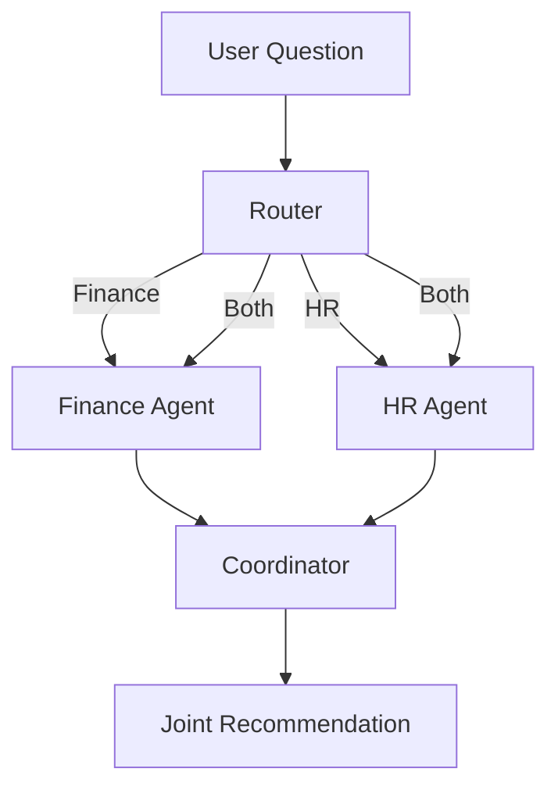

# Cherry Host – AI Engineer Technical Assessment
## Codex Project Brief and Implementation Instructions

You are building a small, high-quality TypeScript submission for the **Cherry Host / REJ Investment AI Engineer Technical Assessment**.

The goal is not to build a large production system. The goal is to demonstrate:

- clean TypeScript
- sound AI architecture
- secure agent isolation
- reliable routing
- grounded responses based on supplied data
- thoughtful multi-agent orchestration
- clear trade-offs
- strong documentation
- code that is easy to explain in a follow-up interview

The implementation should stay intentionally small, but the architectural ideas should reflect how the solution could evolve into a real production system.

## Differentiation Goal

Most candidates may produce two prompts, two API calls, a basic router, and a generic README. This submission should stand out through **verifiable engineering decisions**, not through unnecessary scope.

The strongest differentiators are:

1. Every important numerical claim is traceable to an exact source field.
2. Agent isolation is demonstrated with code structure and tests, not only described in prompts.
3. Cross-department decisions are produced through controlled orchestration rather than an open-ended agent conversation.
4. The routing layer is deterministic where possible, uses an LLM only when useful, and exposes its decision.
5. The CLI can explain which agents were selected, which fields were used, and why the final recommendation was produced.
6. The README clearly distinguishes AI-assisted implementation from the architectural and product decisions made by the developer.

---


# 1. Company and Product Context

Cherry Host and REJ Investment share one platform and one codebase.

## Cherry Host

Cherry Host is a Madrid-based student rental and property-management business.

Its platform includes:

- property search
- property details
- student applications
- application queues
- lease management
- rent tracking
- tenant portal
- maintenance tickets
- room-by-room check-in and check-out
- inventory tracking
- deposit deductions

## REJ Investment

REJ Investment serves Israeli investors buying properties in Madrid.

Its platform includes:

- property sourcing
- investment simulations
- ROI and IRR calculations
- acquisition pipeline
- investor portfolio views
- documents
- shared simulations

## Existing Platform Stack

The platform is described as using:

- React
- TypeScript
- Tailwind
- Supabase
- PostgreSQL
- Supabase Auth
- Supabase Edge Functions
- Supabase Realtime
- Supabase Storage
- Resend
- Twilio

The current platform reportedly uses one application and one Supabase database with many tables shared across several departments.

---

# 2. Long-Term AI Vision

The company wants a multi-layer AI architecture.

## Platform Brain

A central AI with visibility across companies and departments.

Responsibilities may include:

- company-wide analysis
- cross-department recommendations
- reports
- orchestration
- virtual AI agent meetings

## Department Agents

Each department has its own specialized agent.

Examples:

- Finance Agent
- HR Agent
- Rental Operations Agent
- Marketing Agent
- Acquisition Agent
- Property Sales Agent

Each department agent must only access its own authorized data.

## Employee Assistants

Each employee may eventually receive a personal AI assistant that learns communication style and helps draft messages, emails, replies, and recommendations.

This assessment only requires a very small proof of concept with two department agents.

---

# 3. Assessment Requirements

Build a TypeScript application with:

1. A **Finance Agent**
2. An **HR Agent**
3. A unique system prompt for each agent
4. Hardcoded mock JSON data for each department
5. A routing function that receives a user question
6. The routing function sends the question to the correct agent
7. A bonus flow where both agents contribute to a joint recommendation
8. Claude or OpenAI API integration
9. A clear README
10. No database
11. No UI
12. No unnecessary production infrastructure

Example joint question:

> Should we hire more people?

The expected submission includes:

- code
- README
- written answers to the three architecture questions

---

# 4. Core Design Principles

## 4.1 System Prompts Are Not Security Boundaries

System prompts guide model behavior but do not provide real isolation.

Do not rely on instructions such as:

> You are the Finance Agent. Never access HR data.

Real isolation must be enforced in application code.

Each agent should receive:

- only its own tools
- only its own data
- only its own prompt
- no shared unrestricted company object

The Finance Agent must never receive HR data.

The HR Agent must never receive Finance data.

---

## 4.2 The LLM Must Not Invent Business Data

All factual business claims must come from mock data supplied by the application.

The LLM may:

- summarize
- compare
- explain
- identify risks
- produce recommendations

The LLM must not:

- invent missing revenue values
- invent employee counts
- invent salary data
- invent budget information
- claim certainty when data is missing

When relevant data is unavailable, the response should explicitly say so.

---

## 4.3 Structured Outputs Are Preferred

Use structured output schemas where practical.

Examples:

- routing decision
- department analysis
- joint recommendation
- facts used
- missing information
- confidence

Avoid relying only on free-form text when the result is used programmatically.

## 4.4 Claims Must Be Verifiable

Do not stop at prompting the model not to hallucinate. Add an application-level verification step.

Each important factual claim, especially a numerical one, should include:

- a human-readable claim
- the value used
- the exact source field
- optionally the reporting period

Example:

```ts
export interface GroundedFact {
  claim: string;
  value: string | number;
  sourceField: string;
  reportingPeriod?: string;
}
```

Example output:

```json
{
  "claim": "The available annual hiring budget is €52,000.",
  "value": 52000,
  "sourceField": "availableHiringBudget",
  "reportingPeriod": "2026"
}
```

After receiving the model response, validate that:

1. `sourceField` exists in the agent's authorized dataset.
2. The returned value matches the dataset value.
3. The agent did not reference fields belonging to another department.
4. Unknown or mismatched claims are rejected or retried.

This verification layer is a major differentiator because it turns grounding from a prompt instruction into an enforceable system behavior.

---

## 4.5 Keep the Scope Small

## 4.4 Keep the Scope Small

Do not build:

- a web UI
- authentication
- a real database
- a real queue
- Docker infrastructure unless trivial
- a full agent framework
- a complex vector database
- a microservice architecture

The assessment is expected to take only a few hours.

Favor clarity over overengineering.

---

# 5. Recommended Project Structure

Use a structure similar to:

```text
src/
  agents/
    finance-agent.ts
    hr-agent.ts
    base-agent.ts
    types.ts

  data/
    finance.json
    hr.json

  llm/
    client.ts
    openai-client.ts
    types.ts

  prompts/
    finance-prompt.ts
    hr-prompt.ts
    coordinator-prompt.ts
    router-prompt.ts

  routing/
    router.ts
    routing-rules.ts
    routing-schema.ts

  orchestration/
    joint-recommendation.ts

  config/
    env.ts

  index.ts

tests/
  router.test.ts
  isolation.test.ts
  joint-recommendation.test.ts

README.md
ASSESSMENT_ANSWERS.md
.env.example
package.json
tsconfig.json
```

This structure is a recommendation, not a strict requirement.

Keep modules small and focused.

---

# 6. Domain Types

Create explicit domain types.

Example:

```ts
export type AgentId = "finance" | "hr";

export type RouteTarget = AgentId | "both" | "unsupported";

export interface RouteDecision {
  target: RouteTarget;
  confidence: number;
  reason: string;
  intent: string;
}
```

Create separate data types for each department.

Example:

```ts
export interface FinanceData {
  reportingPeriod: string;
  monthlyRevenue: number;
  monthlyOperatingCosts: number;
  availableHiringBudget: number;
  cashRunwayMonths: number;
  projectedAnnualGrowthPercent: number;
}
```

```ts
export interface HrData {
  reportingPeriod: string;
  totalEmployees: number;
  openRoles: number;
  averageWeeklyHours: number;
  overtimeHoursLastMonth: number;
  voluntaryTurnoverPercent: number;
  departments: Array<{
    name: string;
    headcount: number;
    capacityStatus: "under_capacity" | "balanced" | "over_capacity";
  }>;
}
```

Do not create a single unrestricted object such as:

```ts
const allCompanyData = {
  finance,
  hr,
};
```

and pass it to every agent.

Prefer explicit factory functions:

```ts
const financeAgent = createFinanceAgent(financeData);
const hrAgent = createHrAgent(hrData);
```

Each factory should accept only the department-specific type it needs. This makes the dependency boundary visible and allows TypeScript to help prevent accidental cross-department access.

A central coordinator may receive department summaries, but department agents should receive only their own data.

---

# 7. Mock Data

Create realistic but small mock datasets.

## Finance Data Should Include

- reporting period
- revenue
- operating costs
- profit or margin
- hiring budget
- runway
- growth rate
- optional budget constraints

## HR Data Should Include

- total employee count
- employee distribution by department
- open roles
- overtime or workload indicators
- employee turnover
- capacity status
- optional skill gaps

The data should be internally consistent.

Document assumptions in the README.

Do not use real personal data.

---

# 8. LLM Client Abstraction

Use a small provider abstraction so the business logic does not directly depend on a specific SDK.

Example:

```ts
export interface LlmClient {
  generateText(input: {
    systemPrompt: string;
    userPrompt: string;
  }): Promise<string>;

  generateStructured<T>(input: {
    systemPrompt: string;
    userPrompt: string;
    schema: unknown;
  }): Promise<T>;
}
```

Implement only one provider.

Preferred order:

1. Claude, because the company architecture mentions Claude
2. OpenAI, if implementation is more reliable or familiar

Do not build multiple providers unless it takes almost no extra effort.

Environment variable examples:

```env
ANTHROPIC_API_KEY=
```

or:

```env
OPENAI_API_KEY=
```

Validate required environment variables at startup.

Do not commit API keys.

---

# 9. Finance Agent

The Finance Agent should:

- answer finance-related questions
- use only finance mock data
- mention relevant numbers
- explain budget constraints
- avoid HR conclusions
- identify missing information
- produce a concise recommendation

Its prompt should explicitly define:

- role
- allowed data
- forbidden assumptions
- response format
- requirement to distinguish facts from recommendations
- requirement to say when information is missing

Suggested output shape:

```ts
export interface AgentAnalysis {
  agent: AgentId;
  summary: string;
  facts: Array<{
    label: string;
    value: string | number;
    sourceField: string;
  }>;
  concerns: string[];
  recommendation: string;
  missingInformation: string[];
  confidence: number;
}
```

The `sourceField` should refer to a field in the mock data.

Example:

```json
{
  "label": "Available hiring budget",
  "value": 120000,
  "sourceField": "availableHiringBudget"
}
```

This demonstrates grounding and provenance.

---

# 10. HR Agent

The HR Agent should:

- answer HR-related questions
- use only HR mock data
- analyze workload and staffing
- avoid making financial claims
- identify staffing risks
- state missing information
- produce a concise recommendation

Its prompt should enforce the same structured and grounded behavior as the Finance Agent.

---

# 11. Routing Logic

The router receives only the user question.

It should decide among:

- `finance`
- `hr`
- `both`
- `unsupported`

## Recommended Hybrid Routing

Use deterministic rules first for obvious cases.

Finance keywords may include:

- revenue
- profit
- cost
- budget
- runway
- expense
- cash
- margin
- affordable

HR keywords may include:

- employee
- hiring
- headcount
- workload
- overtime
- turnover
- team
- staff
- vacation
- recruitment

Questions requiring both may include:

- Should we hire more people?
- Can we afford another employee?
- Is the company ready to expand the team?
- Should we reduce headcount?
- Which department should receive the next hire?

For ambiguous questions, optionally use a lightweight LLM classification step.

The routing model must not receive confidential department data.

It only needs:

- the user question
- department definitions
- routing rules

## Routing Fallback

If confidence is low:

- route to `unsupported`, or
- ask for clarification

Do not silently guess.

---

# 12. Joint Recommendation Flow

The bonus flow should show controlled multi-agent orchestration.

Do not create a long free-form conversation between two LLM agents.

Use a predictable sequence:

```text
User question
    ↓
Router selects BOTH
    ↓
Finance Agent produces grounded analysis
    ↓
HR Agent produces grounded analysis
    ↓
Coordinator receives both analyses
    ↓
Coordinator produces joint recommendation
```

The coordinator should receive only:

- the original question
- Finance Agent analysis
- HR Agent analysis

It should not need raw department data.

This is important because it demonstrates information boundaries.

Suggested output:

```ts
export interface JointRecommendation {
  question: string;
  recommendation: "hire" | "do_not_hire" | "hire_conditionally" | "insufficient_data";
  summary: string;
  financePerspective: string;
  hrPerspective: string;
  conditions: string[];
  risks: string[];
  missingInformation: string[];
  confidence: number;
}
```

The coordinator may reconcile conflicting recommendations.

Example:

- HR recommends hiring because the operations team is over capacity.
- Finance recommends caution because the available hiring budget is limited.
- Final answer: hire one role conditionally, subject to a salary cap and a three-month review.

---

# 13. Grounding, Claim Verification, and Hallucination Prevention

The implementation should make hallucination prevention visible and testable.

Use several safeguards:

1. Pass only relevant JSON data to each agent.
2. Tell the agent to use only supplied facts.
3. Require `sourceField` references for numerical claims.
4. Validate structured outputs with a schema.
5. Run a claim verifier after the model response.
6. Reject or retry responses that reference unknown fields or mismatched values.
7. Include missing-information handling.
8. Keep temperature low.
9. Avoid asking the model to calculate values that can be calculated deterministically in code.

Create a small verifier such as:

```ts
export function verifyGroundedFacts<T extends object>(
  data: T,
  facts: GroundedFact[]
): VerificationResult {
  // Confirm that each source field exists and that its value matches.
}
```

The verifier should return a useful result:

```ts
export interface VerificationResult {
  valid: boolean;
  errors: string[];
}
```

Where possible, calculate metrics in TypeScript.

Example:

```ts
const operatingProfit =
  financeData.monthlyRevenue - financeData.monthlyOperatingCosts;
```

Then provide the calculated value to the model.

Do not rely on the LLM for simple arithmetic.

A response that fails verification should not be presented as a trusted business answer.

---

# 14. Security and Agent Isolation

Even though this submission uses mock JSON, the architecture should model real security principles.

## Current Assessment

Enforce isolation by:

- separate agent classes or functions
- separate data imports
- explicit dependencies
- no global shared data object
- agent-specific prompts
- agent-specific input types

## Production Evolution

Explain in the README that a real Supabase implementation would use:

- authenticated user identity
- company or tenant ID
- department authorization
- Row Level Security
- restricted database views
- RPC functions
- server-side authorization
- agent-specific tool allowlists
- audit logging
- query validation
- no unrestricted database access from the LLM

The model should never generate arbitrary SQL that is executed directly.

Instead, use approved tools such as:

```ts
getMonthlyFinanceSummary()
getDepartmentHeadcount()
getOpenRoles()
getRentalVacancySummary()
```

Each tool should perform authorization before accessing data.

---

# 15. Error Handling

Handle:

- missing API key
- invalid route result
- LLM timeout
- malformed structured output
- unsupported question
- provider error
- empty question
- failed joint orchestration

Errors should be understandable.

Example:

```ts
throw new Error(
  "The Finance Agent could not return a valid grounded response."
);
```

Do not expose secrets or raw provider error payloads to end users.

---

# 16. CLI Behavior

A simple CLI is sufficient.

Example:

```bash
npm run dev -- "What is our current profit margin?"
```

or interactive mode:

```bash
npm run dev
```

Possible output:

```text
Route: finance
Reason: The question asks about profit margin.

Finance Agent:
...
```

For a joint question:

```text
Route: both

Finance Perspective:
...

HR Perspective:
...

Joint Recommendation:
...
```

No UI is needed.

## Explain Mode

Add an optional `--explain` flag.

Example:

```bash
npm run dev -- "Should we hire more people?" --explain
```

The output should expose the system's decision path without exposing private model chain-of-thought.

Example:

```text
Routing decision: BOTH

Why:
The question requires HR capacity data and Finance affordability data.

Finance fields used:
- availableHiringBudget
- cashRunwayMonths
- monthlyOperatingProfit

HR fields used:
- overtimeHoursLastMonth
- operationsCapacityStatus
- openRoles

Final recommendation:
Hire conditionally.
```

The explanation should be based on structured metadata already produced by the application, not hidden reasoning from the LLM.

---

# 17. Tests

Add a small but meaningful test suite.

## Router Tests

Test questions such as:

- "What is our monthly revenue?" → finance
- "How many employees do we have?" → hr
- "Should we hire more people?" → both
- "What is the weather tomorrow?" → unsupported
- "Can we afford another operations employee?" → both

## Isolation Tests

Verify:

- Finance Agent receives only `FinanceData`
- HR Agent receives only `HrData`
- Finance prompt does not contain HR data
- HR prompt does not contain finance data
- coordinator receives summaries rather than raw data
- Finance output cannot cite an HR-only field
- HR output cannot cite a Finance-only field

Where practical, make invalid dependency wiring fail at compile time through department-specific TypeScript types.

## Claim Verification Tests

Verify:

- valid source fields pass
- unknown source fields fail
- mismatched values fail
- numerical claims cannot silently bypass validation
- a response that fails verification is not returned as trusted output

## Validation Tests

Verify:

- unknown source fields are rejected
- invalid route values are rejected
- empty questions fail gracefully

Mock the LLM client in unit tests.

Do not make real API calls in tests.

---

# 18. Written Assessment Answers

Create `ASSESSMENT_ANSWERS.md`.

Each answer should contain approximately 5–10 sentences.

## Question 1: Agent Isolation

The answer should explain:

- prompts are behavioral guidance, not security
- each agent receives only an allowlist of approved tools
- authorization is checked server-side
- Supabase RLS or database roles enforce data boundaries
- agent identity, user identity, company ID, and department must be validated
- no arbitrary SQL should be accepted from the model
- sensitive calls should be logged
- access should fail closed

## Question 2: AI Agent Meeting

The answer should explain:

- a central orchestrator controls the meeting
- each department agent first fetches verified metrics
- agents return structured summaries
- every number contains a source and reporting period
- the central agent summarizes, but does not invent metrics
- conflicting facts trigger validation rather than guessing
- missing data is explicitly marked
- the final report preserves provenance

## Question 3: Scale and Rate Limits

The answer should explain:

- 15 employees at 2–3 requests per minute create roughly 30–45 requests per minute
- use bounded concurrency
- use a queue for non-interactive work
- retry with exponential backoff and jitter
- cache stable context and repeated answers where safe
- use smaller models for routing and classification
- reserve stronger models for complex reasoning
- summarize long histories
- track token usage, cost, latency, and errors
- degrade gracefully when provider limits are reached

---

# 19. README Requirements

The README must be treated as part of the assessment.

Include:

## Overview

What the project does.

## Architecture

Explain:

- routing
- agent isolation
- LLM abstraction
- joint orchestration
- structured outputs

## Diagram

Include a simple Mermaid diagram.

Example:



## Setup

Include:

```bash
npm install
cp .env.example .env
npm run dev
npm test
```

## Example Questions

Include several finance, HR, joint, and unsupported questions.

## Security and Isolation

Explicitly state:

> System prompts guide model behavior, but they are not treated as a security boundary.

Explain how the assessment enforces isolation and how production Supabase would enforce it.

## Trade-Offs

Discuss:

- deterministic versus LLM routing
- raw data versus summaries
- model flexibility versus reliability
- simplicity versus production readiness
- open-ended agent conversation versus controlled orchestration
- prompt-only grounding versus application-level verification

## AI-Assisted Development Disclosure

Include a short and confident note such as:

> I used AI-assisted development to accelerate implementation, while independently defining and validating the architecture, security boundaries, data contracts, routing behavior, verification rules, tests, and trade-offs.

Do not apologize for using AI. The important distinction is that the developer owns the decisions, reviews the output, and can explain and modify the system.

## Production Evolution

Explain how this would extend to:

- Supabase
- RLS
- function calling
- audit logs
- queues
- caching
- observability
- more department agents

## Limitations

Be honest:

- mock data only
- one LLM provider
- no persistent conversation memory
- no real authentication
- no production queue
- no live database

---

# 20. Code Quality Standards

Use:

- strict TypeScript
- explicit types
- small functions
- descriptive names
- no `any` unless unavoidable
- environment validation
- schema validation
- async error handling
- comments only where they explain non-obvious decisions

Recommended libraries:

- `zod` for schemas
- provider SDK for Claude or OpenAI
- `vitest` for tests
- `tsx` for local execution
- `dotenv` only if needed

Do not add a heavy agent framework unless there is a very strong reason.

Avoid unnecessary dependencies.

---

# 21. Suggested Package Scripts

```json
{
  "scripts": {
    "dev": "tsx src/index.ts",
    "build": "tsc",
    "start": "node dist/index.js",
    "test": "vitest run",
    "test:watch": "vitest",
    "typecheck": "tsc --noEmit"
  }
}
```

---

# 22. Suggested Implementation Order

Follow this order.

## Phase 1: Initialize

- create TypeScript project
- enable strict mode
- add scripts
- add environment validation
- create folder structure

## Phase 2: Domain and Data

- define types
- create Finance JSON
- create HR JSON
- verify internal consistency

## Phase 3: LLM Layer

- create `LlmClient`
- implement one provider
- add structured output handling
- add provider error mapping

## Phase 4: Agents

- implement Finance Agent
- implement HR Agent
- add unique prompts
- enforce separate data dependencies

## Phase 5: Router

- add deterministic routing
- add ambiguous-question fallback if needed
- return structured decision

## Phase 6: Joint Orchestration

- run both agents
- pass analyses to coordinator
- produce final structured recommendation

## Phase 7: CLI

- accept user question
- print route and response
- support examples

## Phase 8: Tests

- router tests
- isolation tests
- structured output tests
- joint orchestration test

## Phase 9: Documentation

- README
- assessment answers
- `.env.example`

## Phase 10: Final Review

Run:

```bash
npm run typecheck
npm test
npm run build
```

Then manually test:

```bash
npm run dev -- "What is our monthly revenue?"
npm run dev -- "Which team is over capacity?"
npm run dev -- "Should we hire more people?"
npm run dev -- "What is the weather in Madrid?"
```

---

# 23. Acceptance Criteria

The solution is complete when:

- the project builds successfully
- tests pass
- Finance questions route to Finance
- HR questions route to HR
- cross-department questions route to both
- unsupported questions are handled
- Finance Agent cannot access HR data
- HR Agent cannot access Finance data
- joint recommendation includes both perspectives
- numerical claims are grounded in supplied data
- numerical claims include traceable source fields
- invalid or mismatched claims are rejected
- `--explain` shows routing and evidence metadata
- missing data is acknowledged
- API keys are not committed
- README explains architecture and trade-offs
- written answers address all three questions
- no UI or unnecessary infrastructure is added

---

# 24. Interview Preparation Notes

The code should be easy to walk through in a follow-up interview.

Be ready to explain:

1. Why system prompts are not security boundaries
2. Why each agent receives only its own data
3. Why the router does not receive department data
4. Why the coordinator receives summaries rather than raw data
5. How hallucinated numbers are prevented
6. Why simple calculations are performed in code
7. Why structured outputs are used
8. Why a hybrid router was chosen
9. How this would work with Supabase RLS
10. How the system would scale to eight agents
11. How provider rate limits would be handled
12. What was intentionally left out because of the time limit
13. How the claim verifier detects unsupported numbers
14. Why an open-ended agent-to-agent conversation was avoided
15. How AI-assisted coding was reviewed and validated

Do not claim the solution is production-ready.

Describe it as a focused architectural proof of concept.

---

# 25. Important Constraints for Codex

While implementing:

- do not overengineer
- do not create a frontend
- do not add authentication
- do not add a database
- do not create eight agents
- do not expose all data to all agents
- do not treat prompts as security
- do not let the LLM invent numbers
- do not trust numerical claims without source-field verification
- do not build a theatrical open-ended conversation between agents
- do not expose hidden chain-of-thought in explain mode
- do not call the real API in tests
- do not commit secrets
- do not hide limitations
- do not replace clear TypeScript with an agent framework abstraction
- do not add features that make the project harder to explain

The strongest submission is not the largest one.

The strongest submission is a small, reliable, clearly documented system that demonstrates correct architecture and sound engineering judgment.
